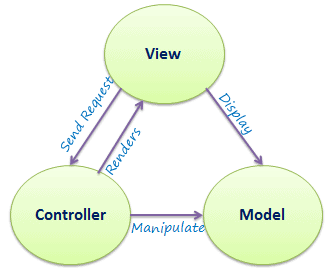

# MVC (Model-View-Controller) with Python Flask
## Python Flask

- Flask is a Python micro-framework


```Python
# Installing flask

from flask import Flask

# create object of this class

app = Flask(__name__)  # creating an app instance


# create func to link to homepage
# create function to browser
@app.route("/")  # decorating our function with @app.route  to set route in browser
def index():
    return " Welcome to DevOps Eng 89 DevOps team"


# create a welcome page
@app.route("/welcome/")  # best practice to have / at end to load page for both cases
def welcome():
    return "<h2> Welcome page for Flask app </h2>"


# create a decorator to route traffic to login page
# display 2 messages of your choice in form of h1 and h2
@app.route("/login/")
def login():
    return "<h1> Enter your details to login </h1> <br> <h2> must follow correct credentials </h2>"
```

